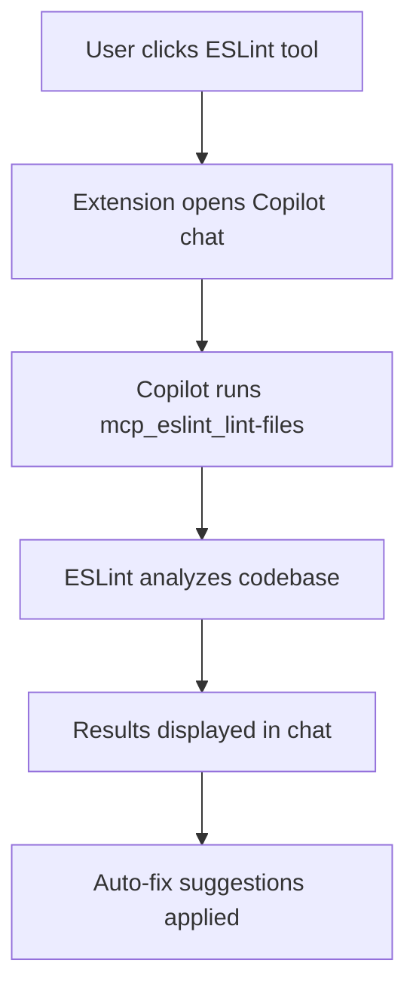

# CodeGuard Pro

**CodeGuard Pro** is an AI-powered VS Code extension that leverages Model Context Protocol (MCP) tools to provide comprehensive code quality, security, and testing analysis. When you click on any tool, it enables the corresponding MCP server and runs the analysis through Copilot, giving you intelligent, context-aware results.

## 🚀 Features

### 🤖 AI-Powered Analysis

- **MCP Integration**: Uses Model Context Protocol for standardized tool communication
- **Copilot Integration**: Runs all tools through GitHub Copilot for enhanced analysis
- **Intelligent Prompts**: Context-aware prompts that guide Copilot to run the right tools
- **Real-time Results**: Get immediate feedback and actionable insights

### 🎯 All-in-One Quality Dashboard

- **Dedicated Sidebar**: Custom activity bar icon for quick access
- **Organized Tools**: Categorized view of all quality tools
- **Real Tool Names**: See exactly which tools are being used (ESLint, Biome, Playwright, etc.)
- **Tool Descriptions**: Understand what each tool does before running it
- **🔥 Live API Integration**: Real connections to Codacy, SonarQube, CodeClimate, and more

### 🔧 Supported Tools

#### Linting & Code Style

- **ESLint**: Industry-standard JavaScript/TypeScript linting with extensive rule ecosystem
- **Biome**: Fast, modern alternative to ESLint + Prettier with zero-config setup
- Auto-fix capabilities for both tools

### Advanced Analysis

- **Code Metrics & Complexity**: Plato reports, cognitive complexity analysis
- **Duplicate Code Detection**: JSCPD integration for finding code duplication
- **Dependency Analysis**: Unused dependencies, vulnerability scanning, update checking
- **Code Structure Analysis**: Dependency graphs, circular dependency detection
- **SonarJS Integration**: Advanced code quality rules

### 🌐 Live API Integrations

- **Codacy API**: Real-time project analysis with quality grades and coverage metrics
- **SonarQube API**: Live quality gate status, bug counts, and technical debt
- **CodeClimate API**: Maintainability ratings and test coverage reporting
- **More APIs**: Snyk Code, CodeFactor (coming soon)

### Security & Compliance

- **Advanced Security Audit**: ESLint security plugin, Audit CI integration
- **Dependency Vulnerability Scanning**: Retire.js and npm audit
- **Security-focused Linting**: Specialized security rule sets

### Reporting & Insights

- **Quality Reports**: Generate comprehensive quality reports
- **Status Bar Integration**: Quick access to quality tools
- **Tree View Panel**: Organized quality actions in sidebar

## � How It Works

### MCP-Powered Tool Execution

1. **Click a Tool**: Select any quality tool from the sidebar
2. **MCP Activation**: The extension opens Copilot chat with a specialized prompt
3. **Tool Execution**: Copilot runs the appropriate MCP tool (ESLint MCP, Code Runner MCP, etc.)
4. **Results Analysis**: Get intelligent analysis and recommendations
5. **Auto-Fixes**: Many tools can automatically apply fixes when possible

### Supported MCP Tools

- **ESLint MCP**: Direct integration with ESLint for linting
- **Codacy MCP**: Code quality analysis through Codacy platform
- **Code Runner MCP**: Execute any terminal command through MCP
- **Sequential Thinking MCP**: Complex analysis and reasoning

### Example Workflow



## ⚙️ Configuration

Configure the extension through VS Code settings:

```json
{
  "codeguard-pro.enableStatusBar": true,
  "codeguard-pro.autoLintOnSave": false,
  "codeguard-pro.lintTool": "auto",
  "codeguard-pro.testFramework": "playwright",
  "codeguard-pro.duplicateCodeThreshold": 100,
  "codeguard-pro.complexityThreshold": 15,
  "codeguard-pro.enableSonarAnalysis": true,
  "codeguard-pro.securityLevel": "moderate"
}
```

### Configuration Options

- **enableStatusBar**: Show/hide status bar integration
- **autoLintOnSave**: Automatically lint code when files are saved
- **lintTool**: Choose between "auto", "biome", or "eslint"
- **testFramework**: Select from "playwright", "cypress", "selenium", "puppeteer"
- **duplicateCodeThreshold**: Minimum token count for duplicate detection
- **complexityThreshold**: Maximum cognitive complexity allowed
- **enableSonarAnalysis**: Enable/disable SonarJS analysis
- **securityLevel**: Security vulnerability threshold ("low", "moderate", "high", "critical")

## 🛠️ Integrated Tools

### Linting & Formatting

- **Biome**: Fast linter and formatter
- **ESLint**: Configurable JavaScript/TypeScript linter
- **JSHint**: JavaScript code quality tool

### Security Analysis

- **ESLint Security Plugin**: Security-focused linting rules
- **Retire.js**: Vulnerability scanning for JavaScript libraries
- **Audit CI**: Enhanced npm audit with CI integration
- **npm audit**: Built-in dependency vulnerability scanner

### Code Analysis

- **SonarJS**: Advanced code quality and complexity analysis
- **JSCPD**: Copy-paste detector for duplicate code
- **Plato**: Code complexity visualization
- **Madge**: Dependency graph analysis
- **Depcheck**: Unused dependency detection

### Testing & Utilities

- **Playwright**: Modern E2E testing framework
- **Cypress**: Developer-friendly E2E testing
- **npm-check-updates**: Dependency update checker
- **TypeScript**: Static type checking

## 📊 Quality Metrics

The extension tracks and reports on:

- **Code Complexity**: Cyclomatic and cognitive complexity
- **Code Coverage**: Test coverage metrics
- **Duplicate Code**: Percentage and locations of duplicated code
- **Dependencies**: Unused, outdated, and vulnerable packages
- **Security Issues**: Vulnerability count and severity
- **Type Safety**: TypeScript error count and types

## 🚀 Getting Started

### Prerequisites

- Node.js 18+
- npm or yarn
- VS Code with GitHub Copilot
- MCP servers configured in Copilot settings

### Installation

1. Install the extension from VS Code marketplace
2. Ensure GitHub Copilot is installed and configured
3. Configure MCP servers in your Copilot settings
4. Open a project in VS Code
5. The CodeGuard Pro panel will appear in the Explorer sidebar

### Quick Start

1. **Open the Sidebar**: Click the CodeGuard Pro icon in the activity bar
2. **Choose a Tool**: Click any tool (e.g., "ESLint" under Linting & Formatting)
3. **Copilot Chat Opens**: The extension automatically opens Copilot chat with the right prompt
4. **Analysis Runs**: Copilot executes the MCP tool and analyzes your code
5. **Review Results**: Get intelligent feedback and apply fixes

### MCP Server Setup

To get the full benefit of CodeGuard Pro, ensure these MCP servers are configured:

- **ESLint MCP**: For direct ESLint integration
- **Codacy MCP**: For code quality analysis
- **Code Runner MCP**: For executing terminal commands
- **Sequential Thinking MCP**: For complex analysis tasks

Configure MCP servers in your GitHub Copilot settings or organization settings.

## 📈 Development

### Project Structure

```
src/
├── extension.ts                 # Main extension entry point
├── services/
│   └── QualityToolsService.ts   # Core quality tools logic
├── providers/
│   └── QualityHubProvider.ts    # Tree view data provider
└── ui/
    └── StatusBarManager.ts      # Status bar integration
```

### Building

```bash
npm install          # Install dependencies
npm run compile      # Compile TypeScript
npm run watch        # Watch mode for development
npm run lint         # Run ESLint
```

### Configuration Files

- `.eslintrc.json`: Standard ESLint configuration
- `.eslintrc.security.json`: Security-focused ESLint rules
- `.eslintrc.sonar.json`: SonarJS quality rules
- `biome.json`: Biome linter and formatter settings
- `audit-ci.json`: Security audit configuration

## 🤝 Contributing

1. Fork the repository
2. Create a feature branch
3. Make your changes
4. Add tests if applicable
5. Submit a pull request

## 📄 License

MIT License - see LICENSE file for details

## 🔧 Troubleshooting

### Common Issues

- **Tool not found**: Ensure Node.js is in your PATH
- **Permission errors**: Run VS Code as administrator if needed
- **Analysis timeout**: Increase timeout in extension settings
- **Memory issues**: Close other applications during large project analysis

### Support

- Create an issue on GitHub
- Check the Output panel for detailed error messages
- Consult the VS Code Developer Tools for debugging
